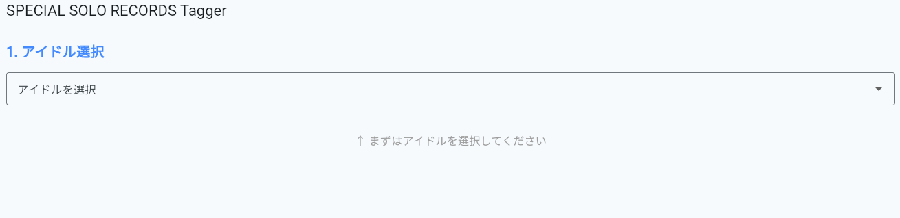
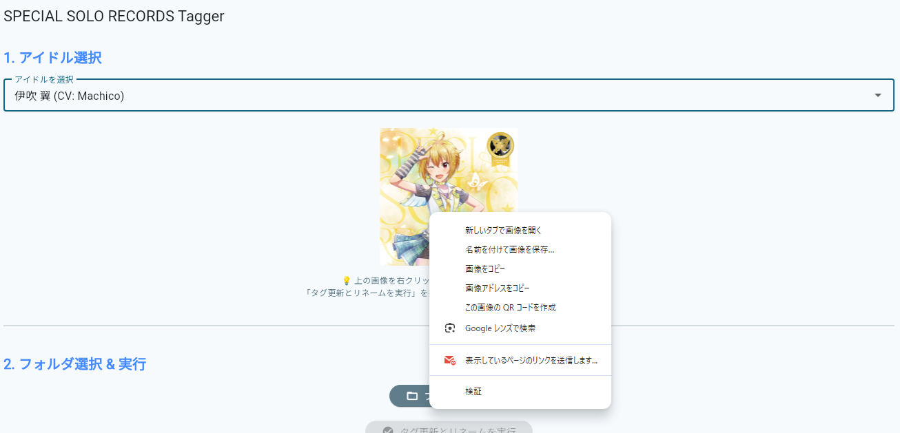
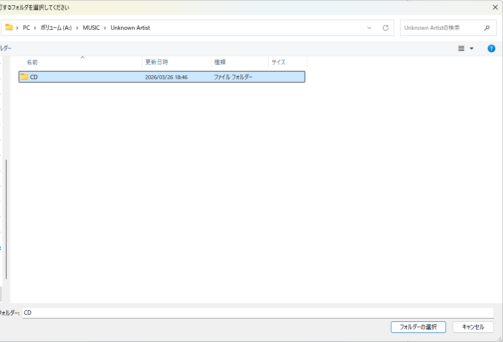
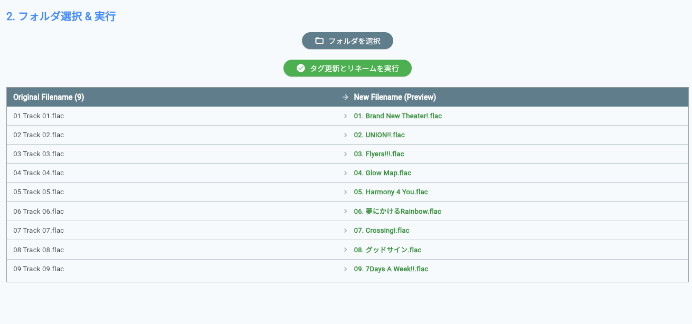
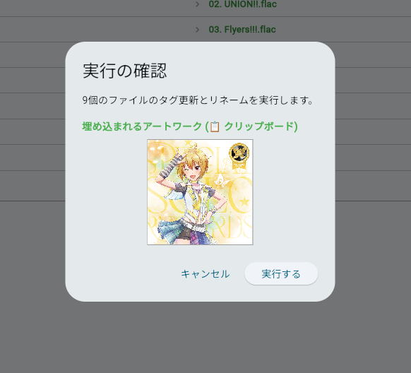
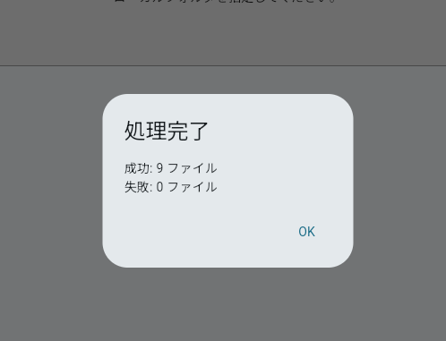

# SPECIAL SOLO RECORDS Tagger
ソロレコのCDDBが仕事してないみたいなので趣味ついでに作りました。  
https://bluetiger.github.io/million_solo_record_tagger/

## 主な機能
* ファイル名が楽曲名に変更されます
* 以下のタグが追加されます
    * 楽曲名(Title)
    * アルバム名(Album)
    * アーティスト名(AlbumArtist)
    * 年(Year)
    * トラック番号(Track)
    * ジャンル(Genre)
    * 作曲者(Composer)
    * 作詞者(Lyricist)
* アートワークが追加されます

## 注意事項
* すべて自己責任で行ってください  
ファイルが破損したりしても責任を負えません

### 対応してる拡張子
* MP3
* WAV
* FLAC

### 変換ファイルの対応
* 読み込んだファイルをソートしてから上から9個を対象にします  
1番目から自動的に割り当ててしまうので必要があればファイル名を変更してください
  * 1~9をファイル名の頭につけるのが早いと思います

## 使い方
1. まずアイドルを選択します  

2. アートワークを右クリックして「画像をコピー」します

3. 楽曲のあるフォルダを選択します  
このときファイルの表示とコピーを許可しますかと確認がでますが許可するを押してください  
※ファイルをどこかに送信したりするわけではありません

 
4. 読み込まれたファイルの名前と変更後のファイル名を確認します

5. 「タグ更新とリネームを実行」と書かれた緑のボタンを押します  
ここでもクリップボードへのアクセスを許可するか聞かれますが許可してください
6. このような確認画面が出ると思います。  
アートワークに問題がなければ実行するを押してください。  
問題があって修正したいときはキャンセルをおして2番の作業をもう一度行ってください。  

7. 最後に保存にかんして確認が出るので変更を保存を押してください  
プログレスバーが最後まで到達して完了ポップアップがでれば終了です

## バグや機能追加等
issue建てたりPR出したりできる人はやってください  
良く分からんって人はX(https://x.com/bluetiger_ts)まで